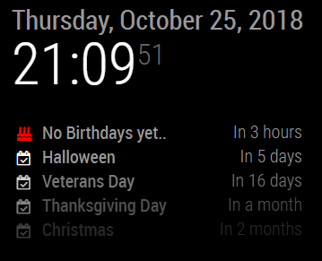

[](https://github.com/ulrichwisser/MMM-CardDavBirthdaysProvider/blob/master/LICENSE.md)

# MMM-CardDavBirthdaysProvider
Forked from [MMM-GoogleBirthdaysProvider](https://github.com/PalatinCoder/MMM-GoogleBirthdaysProvider). 

A *big* thank you to PalatinCoder for the original code.


> ## 🛠 Work in progress
> Please open an issue or cantact me with any questions or error reports.

## How it works

The module extracts birthdays from a Cardav feed and exposes them as an iCal Feed through an internal URL, so you can include it in the default calendar. The list of birthdays is updated every hour.



## Prerequisites

## Installation

1. In your `modules/` directory, `git clone https://github.com/ulrichwisser/MMM-CardDavBirthdaysProvider.git`
2. `cd` in the new `MMM-CardDavBirthdaysProvider` directory
3. `npm install --production` (note the production flag, so you don't get all the dev dependencies - you don't need them if you just want to use the module)
6. Add the module to your `config.js`:
```
{
	module: "MMM-CardDavBirthdaysProvider",
	position: "top_left",
	config: {
		authMethod: 'Basic',
		serverUrl: 'https://secure.carddav.example/',
		credentials: {
			username: 'username',
			password: 'password',
		},
	},
},
```

Note: the module does not display anything. So you can chose any position of your liking. 

MMM-CardDavBirthdaysProvider uses (tsdav)[https://www.npmjs.com/package/tsdav] from npm.io to retrieve carddav data. Please check the tsdav documentation for details on the credentials.

config should have three attributes "authMethod", "serverURL" and "credentials".

E.g
```
config : {
	authMethod: 'Basic',
	serverUrl: 'https://secure.carddav.example/',
	credentials: {
		username: 'username',
		password: 'password',
	},
},
```
or
```
config : {
	authMethod: 'Oauth',	
	serverUrl: 'https://apidata.googleusercontent.com/caldav/v2/',
	credentials: {
		tokenUrl: 'https://accounts.google.com/o/oauth2/token',
		username: 'YOUR_EMAIL_ADDRESS',
		refreshToken: 'YOUR_REFRESH_TOKEN_WITH_CALDAV_PERMISSION',
		clientId: 'YOUR_CLIENT_ID',
		clientSecret: 'YOUR_CLIENT_SECRET',
	},
},
```

7. Add `http://localhost:8080/mmm-carddavbirthdaysprovider` to your calendar URLs, something like this:
   ```
   (...)
		{
			module: "calendar",
			position: "top_left",
			config: {
				calendars: [
					{
						url: 'http://localhost:8080/mmm-carddavbirthdaysprovider',
						symbol: 'birthday-cake',
						color: '#f00'
					}
				]
			}
		}
   (...)
   ```
8. *(optional)* If you want to see which birthday it is, set the following:
   <details><summary>Config Options</summary>
   <p>
   Set `displayRepeatingCountTitle` to `true` and set the suffix for the count in the `repeatingCountTitle` in the calendar's options, like so:

   ```
   (...)
		{
			module: "calendar",
			position: "top_left",
			config: {
				displayRepeatingCountTitle: true,
				calendars: [
					{
						url: 'http://localhost:8080/mmm-carddavbirthdaysprovider',
						symbol: 'birthday-cake',
						repeatingCountTitle: "Birthday"
						color: '#f00'
					}
				]
			}
		}
   (...)
   ```
   </p>
9. That's it, now have fun 😉

## Known Limitations / Issues
